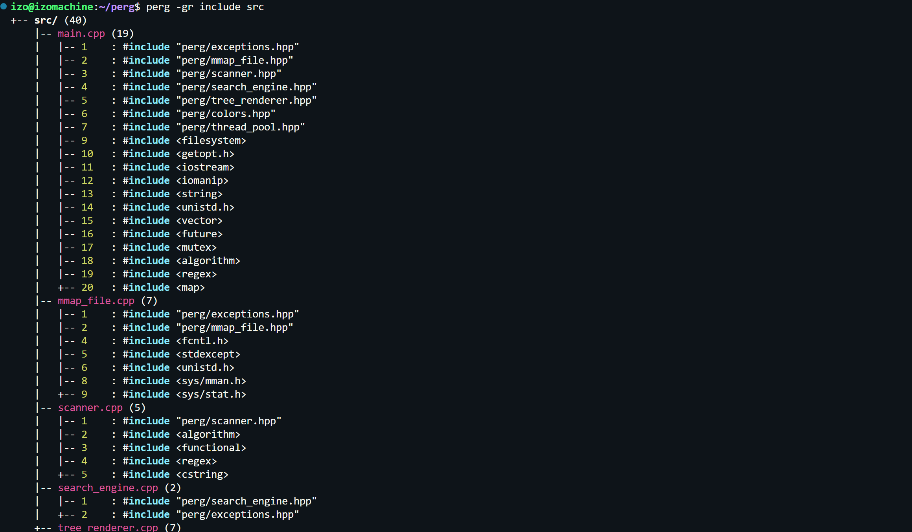

# perg

> A regex pattern scanner and enumeration tool built in C++, utilising memory mapping and multi-threaded parallelism for file traversal.

<p align="center">
    <a href="LICENSE">License</a>
</p>

<p align="center">
  
  
  
  
</p>

---

## Features
- **Zero-Copy I/O**: Leverages `mmap` to map files into the process address space.
- **Concurrency**: Custom Thread Pool implementation to distribute scanning tasks across available CPU cores.
- **SIMD-Accelerated**: Optimized line counting using SIMD-accelerated `memchr`.
- **Directory Trees**: `--graph` mode to visualize match distribution in a terminal-based directory tree.
- **Context Aware**: Supports leading (`-B`) and trailing (`-A`) context lines with prioritized deduplication.

---

## Getting Started

### 1. Clone the repo
```bash
git clone [https://github.com/izo-ong/perg.git](https://github.com/izo-ong/perg.git)
cd perg
```

### 2. Build and Install
```bash
chmod +x install.sh

# Uninstall with the --uninstall flag
./install.sh
```

### 3. Usage
```bash
# Recursive search for a pattern in a directory
perg -r "TODO:" ./src

# Visualize matches in a directory tree with context
perg -g -C 2 "Scanner" include/

# Case-insensitive search with line numbers
perg -in "virtual"
```

### Preview

---

## CLI Options

| Option | Long Flag | Description |
| :--- | :--- | :--- |
| `-A <n>` | `--after-context` | Print `<n>` lines of trailing context. |
| `-B <n>` | `--before-context` | Print `<n>` lines of leading context. |
| `-C <n>` | `--context` | Print `<n>` lines of leading and trailing context. |
| `-c` | `--count` | Only print the total match count per file. |
| `-e <ext>` | `--filter` | Only scan files with a specific extension (e.g., `.cpp`). |
| `-g` | `--graph` | Visualize results in a hierarchical directory tree. |
| `-i` | `--ignore-case` | Perform case-insensitive matching. |
| `-n` | `--line-number` | Prefix output with 1-based line numbers. |
| `-r` | `--recursive` | Recursively scan subdirectories. |
| `--color` | | Force ANSI color highlighting (default in TTY). |
| `--no-color` | | Disable all color output. |

## Performance
*Hyperfine benchmark on a local source code repository:*

| Tool | Mean Time | Speedup |
| :--- | :--- | :--- |
| **grep** | 2.0 ms | 1.0x |
| **ripgrep (rg)** | 105.6 ms | 52.8x |
| **perg** | 474.5 ms | 237.2x |

---

## Tech Stack
- **Language**: C++20
- **Build System**: CMake

---

## Credits
- Built with **C++ Standard Library**.
- Developed by **Isaac Ong**.

---

## License
See [LICENSE](LICENSE).